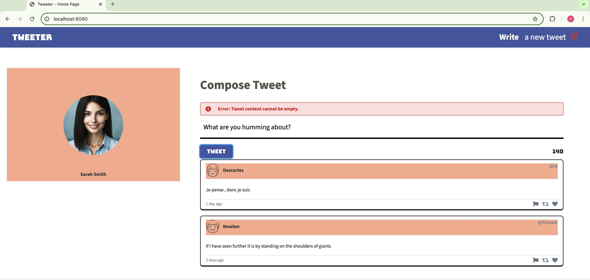

# Tweeter Project

Tweeter is a simple, single-page Twitter clone. Users are able to post tweets, and view the app in mutliple viewpoints. This project required HTML, CSS, JS, jQuery, AJAX front-end skills, Node, and Express back-end skills.

## Final Product
#### Intital Homepage - Desktop

#### Initial Homepage - Tablet

#### Empty Tweet Error Message

#### Tweet Over limit Error Message

#### Writing New Tweet

#### Posted New Tweet

## Dependencies

- Express
- Node 5.10.x or above
- Font Awesome
- Body Parser
- Chance
- md5
- timeago.js
